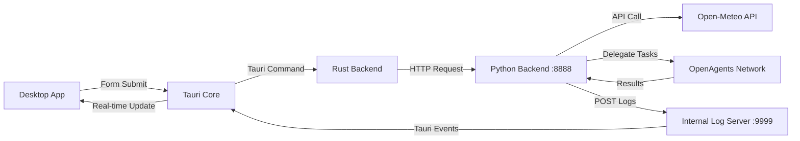

# Travel-Guide-Network
Video:https://www.bilibili.com/video/BV1JfFKzTEdg/?vd_source=eb3f3277e676e4e60b5000d6466252b2


A full-stack intelligent travel recommendation system built with **OpenAgents**, **Tauri**, and **Python**. Four Hogwarts-style AI agents analyze weather data and provide distinct travel advice through a modern desktop application.


## Overview
- **Backend (Python/OpenAgents)**: Orchestrates four AI Agents (Gryffindor, Slytherin, Ravenclaw, Hufflepuff). Fetches real-time weather data and delegates tasks.
- **Desktop App (Tauri + Svelte 5)**: Cross-platform desktop application with real-time log streaming via Tauri events.
- **Orchestrator**: Unified launcher (`main.py`) managing backend and frontend lifecycle.
### The Agents
| Agent | Focus |
|-------|-------|
| 🦁 Gryffindor | Bravery, adventure, outdoor challenges |
| 🐍 Slytherin | Strategic planning, efficiency, resource management |
| 🦅 Ravenclaw | Learning, growth, knowledge, exploration |
| 🦡 Hufflepuff | Comfort, food, relaxation, friendly atmosphere |
## Architecture

## Tech Stack
| Component | Technology |
|-----------|------------|
| Frontend Framework | SvelteKit, Svelte 5 (Runes) |
| Desktop Framework | Tauri 2.x |
| Styling | Tailwind CSS |
| Backend | Python 3.8+ |
| Agent Framework | OpenAgents |
| HTTP Server | `tiny_http` (Rust) |
| HTTP Client | `reqwest` (Rust) |
## Prerequisites
- **Python 3.8+**
- **Rust 1.70+** (for Tauri)
- **Node.js 18+** (development only)
- **pnpm**
  ```bash
  npm install -g pnpm
  ```
- **OpenAgents**
- **LLM Service** (e.g., Ollama, OpenAI compatible)
## Quick Start
### 1. Configure LLM
Edit `network/llm_config.json`:
```json
{
  "DEFAULT_LLM_PROVIDER": "custom",
  "DEFAULT_LLM_BASE_URL": "http://localhost:11434/v1",
  "DEFAULT_LLM_API_KEY": "not-required",
  "DEFAULT_LLM_MODEL_NAME": "gpt-oss:20b"
}
```
### 2. Install Dependencies
```bash
# Backend
cd network
pip install openagents aiohttp psutil requests
# Frontend
cd ../frontend
pnpm install
```
### 3. Launch System
From root directory:
```bash
python main.py
```
This will:
1. Start Python Backend (Network + Agents)
2. Wait for API on port 8888
3. Launch Tauri Desktop Application
### 4. Usage
- Enter city and date offset
- Watch real-time agent logs
- Click "Export Guides PDF" to save
## Project Structure
```
.
├── network/                      # Backend Directory
│   ├── agents/                  # Agent YAML configs
│   ├── tools/                   # Utilities (weather, logging)
│   ├── logs/                    # Runtime logs
│   ├── launch.py                # Backend launcher
│   ├── network.yaml             # Network configuration
│   └── llm_config.json          # LLM settings
├── frontend/                     # Tauri Frontend
│   ├── src/
│   │   ├── routes/              # Svelte pages
│   │   └── app.html             # HTML template
│   ├── src-tauri/
│   │   ├── src/lib.rs           # Rust backend
│   │   ├── tauri.conf.json      # Tauri config
│   │   └── Cargo.toml           # Rust dependencies
│   ├── static/                  # Static assets
│   └── package.json
├── main.py                       # Unified launcher
└── README.md
```
## Configuration
### Ports
| Service | Port | Description |
|---------|------|-------------|
| Backend API | 8888 | Weather Connector API |
| Log Server | 9999 | Rust HTTP Server |
| OpenAgents HTTP | 8700 | Agent Communication |
| OpenAgents gRPC | 8600 | Agent Communication |
### Backend (`network/`)
- **Agent Timeout**: 180s (configurable in `network.yaml`)
- **Weather API**: Open-Meteo (free tier, non-commercial)
- **Authentication**: Default password hash in `network.yaml`
### Frontend (`frontend/`)
- **Rust Server**: `tiny_http` on port 9999 for log streaming
- **Events**: Tauri `listen()` for `log-line` events
- **Security**: `escapeHtml` for XSS prevention
- **Styling**: Tailwind CSS via `@import "tailwindcss"`
### Tauri Config
```json
{
  "productName": "Travel-Guide-Network",
  "identifier": "com.yg.travel-guide-ui",
  "build": {
    "beforeDevCommand": "pnpm dev",
    "devUrl": "http://localhost:1420",
    "beforeBuildCommand": "pnpm build",
    "frontendDist": "../build"
  },
  "app": {
    "windows": [{
      "title": "Travel-Guide-Network",
      "width": 800,
      "height": 600
    }]
  }
}
```
## Development vs Production
| Phase | Node.js Required |
|-------|------------------|
| Development | Yes (for Vite dev server) |
| Production | No (standalone executable) |
## Troubleshooting
| Issue | Cause | Fix |
|-------|-------|-----|
| Connection refused | Backend not running | Check `main.py` terminal for errors |
| Logs not showing | Port 9999 blocked | Restart `main.py`, ensure ports clean |
| Node version too low | Node < 18 | Install Node.js 18+ |
| pnpm not found | Missing pnpm | Run `corepack enable` |
| Rust compilation errors | Outdated toolchain | Run `rustup update` |
| Agent timeout | LLM slow/unresponsive | Increase timeout in `network.yaml` |
## Development Commands
```bash
# Start Tauri only (no backend)
cd frontend
pnpm tauri dev
# Build production executable
pnpm tauri build
# Output: frontend/src-tauri/target/release/bundle/
```
## License
### Project License
MIT License
### Open-Meteo API
**Non-commercial use only.** Obtain a commercial license for commercial use. See [Open-Meteo Terms](https://open-meteo.com/en/terms).
### OpenAgents Framework
Comply with OpenAgents license (typically Apache 2.0).
## Acknowledgments
- [OpenAgents](https://github.com/geekan/OpenAgents) - Multi-agent orchestration
- [Open-Meteo](https://open-meteo.com/) - Weather API
- [Tauri](https://tauri.app/) - Desktop framework
- [Svelte](https://svelte.dev/) - Reactive UI
- [Tailwind CSS](https://tailwindcss.com/) - Styling
