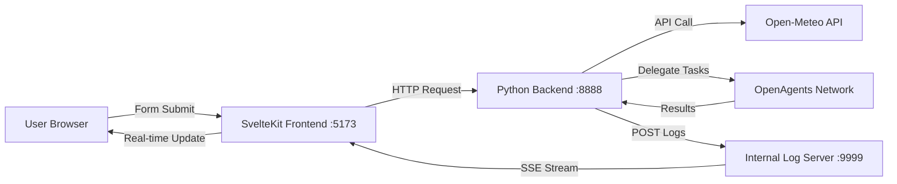

# TravelGuide Multi-Agent System
A full-stack intelligent travel recommendation system built with **OpenAgents**, **SvelteKit**, and **Python**. It simulates a collaborative workflow where four Hogwarts-style AI agents analyze weather data and provide distinct travel advice in real-time.


## 📋 Project Overview
This system demonstrates a modern multi-agent architecture integrated with a reactive web UI:
1.  **Backend (Python/OpenAgents)**: Orchestrates four distinct AI Agents (Gryffindor, Slytherin, Ravenclaw, Hufflepuff). It fetches real-time weather data and delegates tasks sequentially.
2.  **Frontend (SvelteKit)**: Provides a responsive dashboard for users to input travel queries and view real-time streaming logs via Server-Sent Events (SSE).
3.  **Orchestrator**: A unified launcher script (`main.py`) that manages the lifecycle of both the backend services and the frontend server.
### 🏰 The Agents
-   **🦁 Gryffindor**: Focuses on bravery, adventure, and outdoor challenges.
-   **🐍 Slytherin**: Focuses on strategic planning, efficiency, and resource management.
-   **🦅 Ravenclaw**: Focuses on learning, growth, knowledge, and exploration.
-   **🦡 Hufflepuff**: Focuses on comfort, food, relaxation, and a friendly atmosphere.
## 🏗️ System Architecture

The architecture features a unique **Log Relay**: Python agents send results to an internal Node.js server (embedded in the frontend), which pushes updates to the browser instantly.
## 🚀 Quick Start
### Prerequisites
Before running the system, ensure you have the following installed:
-   **Python**: Version 3.8 or higher.
-   **Node.js**: Version 16 or higher.
-   **pnpm**: Fast, disk space efficient package manager.
    ```bash
    npm install -g pnpm
    # or enable corepack: corepack enable
    ```
-   **OpenAgents**: Python framework for agents.
-   **LLM Service**: A running LLM service (e.g., Ollama, OpenAI compatible).
### 1. Configuration
**Configure the Backend LLM:**
Edit `network/llm_config.json` to point to your LLM provider.
```json
{
  "DEFAULT_LLM_PROVIDER": "custom",
  "DEFAULT_LLM_BASE_URL": "http://localhost:11434/v1",
  "DEFAULT_LLM_API_KEY": "not-required",
  "DEFAULT_LLM_MODEL_NAME": "gpt-oss:20b"
}
```
**Install Python Dependencies:**
```bash
cd network
pip install openagents aiohttp psutil requests
```
**Install Frontend Dependencies:**
```bash
cd frontend
pnpm install
```
### 2. Launch the System
The repository includes a unified launcher script that handles the startup sequence automatically (Backend $\to$ Frontend).
From the **root directory**, run:
```bash
python main.py
```
**What happens when you run this?**
1.  The script starts the Python Backend (Network + Agents).
2.  It waits for the Weather Connector API to be ready (Port `8888`).
3.  It automatically launches the SvelteKit Frontend (Port `5173`).
4.  Your browser should open automatically pointing to the dashboard.
### 3. Usage
1.  **Generate Guide**: In the web UI, enter a city (e.g., "London") and date offset.
2.  **Watch Live**: Observe the logs in real-time as agents process the request.
3.  **Export**: Click "Export Guides PDF" to save the generated advice.
## 📂 Project Structure
```
.
├── network/                    # Backend Directory
│   ├── agents/                # Agent YAML configs
│   ├── tools/                 # Utilities (weather, logging)
│   ├── logs/                  # Runtime logs
│   ├── launch.py              # Backend launcher script
│   ├── network.yaml           # Network configuration
│   └── llm_config.json        # LLM provider settings
├── frontend/                   # Frontend Directory
│   ├── src/
│   │   ├── routes/            # SvelteKit pages & API
│   │   └── app.html           # HTML template
│   ├── static/                # Static assets
│   ├── vite.config.ts         # Vite + Internal Log Server
│   ├── svelte.config.js       # Adapter config
│   └── package.json
├── nodejs/                     # (Optional) Portable Node environment for Windows
├── main.py                     # 🌟 Unified System Launcher
└── README.md                   # This file
```
## ⚙️ Configuration Details
### Ports
The system uses the following default ports. Ensure they are available:
| Service               | Port  | Description                              |
| --------------------- | ----- | ---------------------------------------- |
| Frontend (Dev)       | 5173  | SvelteKit Development Server             |
| Backend API          | 8888  | Python Weather Connector API             |
| Internal Log Server  | 9999  | Embedded Log Server (for SSE streaming)  |
| OpenAgents Network   | 8700  | Agent Communication (HTTP)              |
| OpenAgents Network   | 8600  | Agent Communication (gRPC)               |
### Backend (`network/`)
-   **Agent Timeouts**: Default is 180s (configurable in `network.yaml`).
-   **Weather API**: Uses Open-Meteo (Free for non-commercial use).
-   **Authentication**: Uses a default password hash for the coordinator/worker group.
### Frontend (`frontend/`)
-   **Streaming**: Uses Server-Sent Events (SSE) connected to `/api/stream`.
-   **Security**: Implements `escapeHtml` to prevent XSS attacks from agent outputs.
-   **Styling**: Uses Tailwind CSS via Vite plugin.
## 🔒 License & Commercial Usage Notice
### Open-Meteo API Usage Policy
**⚠️ Important:** This project integrates the free API provided by Open-Meteo.
-   **Non-Commercial Use Only**: The free tier of the Open-Meteo API is strictly licensed for **non-commercial purposes**.
-   **Commercial Restriction**: If you intend to deploy this system for commercial use (e.g., selling the service, using it in a business environment), you **must** obtain a commercial license from Open-Meteo or switch to a licensed weather data provider.
-   **Attribution**: Please refer to [Open-Meteo's Terms of Use](https://open-meteo.com/en/terms) for the most up-to-date licensing requirements.
### OpenAgents Framework
This project utilizes the OpenAgents framework. Please ensure you comply with the license of the OpenAgents framework (typically Apache 2.0, refer to the official repository for details).
### Project License
This specific codebase is licensed under the **MIT License**.
## 🐛 Troubleshooting
### "Connection refused" when submitting form
-   **Cause**: The Python backend (`weather_connector.py`) is not running or crashed.
-   **Fix**: Check the terminal where `python main.py` is running. Look for backend errors.
### Logs not appearing in the browser
-   **Cause 1**: Port `9999` is blocked.
-   **Cause 2**: The Python backend `send_result.py` is sending to the wrong URL (must be `http://localhost:9999/log`).
-   **Fix**: Restart `main.py` to ensure ports are clean.
### Frontend won't start on Windows
-   **Cause**: `main.py` looks for a local `nodejs/pnpm.cmd` or a global `pnpm`.
-   **Fix**: Ensure `pnpm` is installed globally (`npm install -g pnpm`) or place the Node.js portable binaries in the `nodejs/` folder at the root.
### Agent Task Timeout
-   **Cause**: LLM is too slow or unresponsive.
-   **Fix**: Increase `agent_timeout` in `network.yaml`.
## 🙏 Acknowledgments
This project is built upon the following excellent open-source tools and services:
-   **[OpenAgents](https://github.com/geekan/OpenAgents)**: A powerful framework for orchestrating multi-agent workflows.
-   **[Open-Meteo](https://open-meteo.com/)**: For providing the free, open-source weather API.
-   **[SvelteKit](https://kit.svelte.dev/)**: The web framework used for the frontend.
-   **[Tailwind CSS](https://tailwindcss.com/)**: For rapid UI development.
---
**Developed with ❤️ using Python and SvelteKit**
