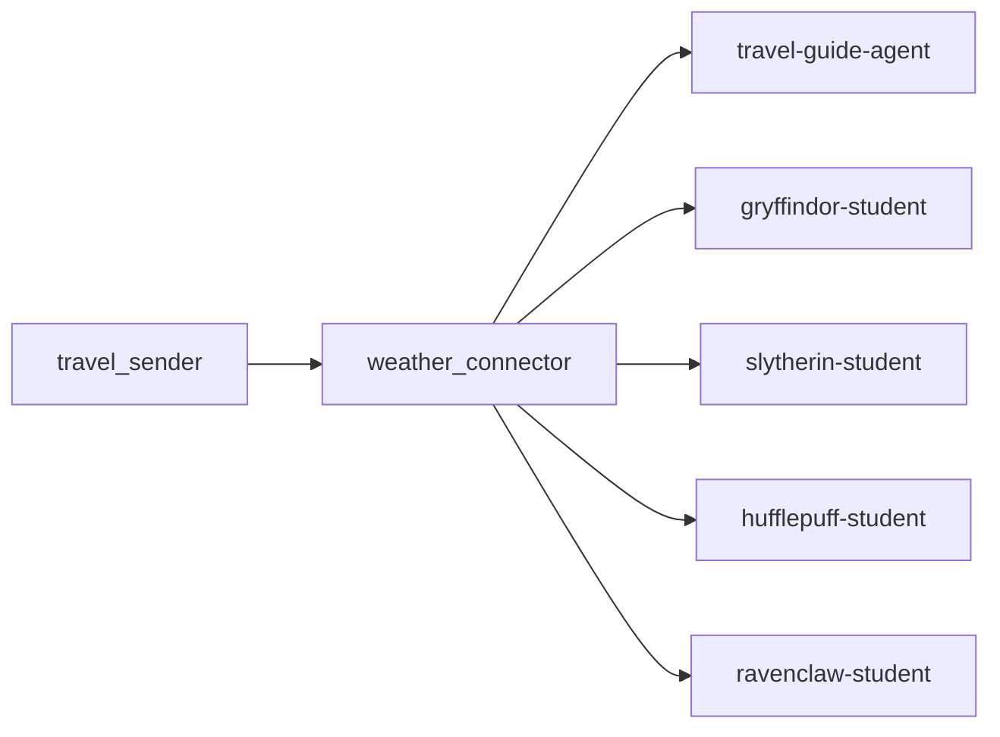

# Travel Guide Workspace

An OpenAgents network that generates travel advice based on real-time weather data. It features a standard travel guide agent and four unique Hogwarts-themed student agents (Gryffindor, Slytherin, Ravenclaw, Hufflepuff) that analyze the same data from different perspectives.


https://www.bilibili.com/video/BV1ti6ZBLEyh/?pop_share=1&spm_id_from=333.40164.0.0&vd_source=eb3f3277e676e4e60b5000d6466252b2

## Overview

This workspace contains a travel guide system that:
- Receives city and date requests via HTTP
- Fetches weather data from Open-Meteo API
- Uses LLM to generate personalized travel recommendations

## Architecture


## Agents

| Agent | Type | Description |
|-------|------|-------------|
| `weather-connector` | Python Worker | Receives HTTP requests, fetches data from Open-Meteo, and publishes to the channel. |
| `travel-guide` | YAML Collaborator | Provides professional, practical travel advice based on weather. |
| `gryffindor-student` | YAML Collaborator | Focuses on **bravery** and adventure activities. |
| `slytherin-student` | YAML Collaborator | Focuses on **strategy**, efficiency, and elegant planning. |
| `ravenclaw-student` | YAML Collaborator | Focuses on **wisdom**, museums, and culture. |
| `hufflepuff-student` | YAML Collaborator | Focuses on **kindness**, comfort, and family-friendly activities. |

## Quick Start

### 1. Launch All Components

```bash
python launcher.py all
```

Or start only core components (Network, Connector, Guide Agent, Studio)

```bash
python launcher.py core
```

This will start:
- Network (ports 8700/8600)
- Weather Connector (port 8889)
- Travel Guide Agent
- Studio Web Interface


### 2. Send Travel Request

Use the sender script:

```bash
Get guide for today
python travel_sender.py Beijing

Get guide for tomorrow (offset=1)
python travel_sender.py Beijing 1

Get guide for day after tomorrow (offset=2)
python travel_sender.py Shanghai 2

Get guide for specific date
python travel_sender.py Tokyo 2026-01-20

```
## Configuration

- **Network Port:** 8700 (HTTP), 8600 (gRPC)
- **Connector HTTP Port:** 8889
- **Studio:** http://localhost:8700/studio/
- **MCP:** http://localhost:8700/mcp
- **Channel:** `travel-guide-stream`

## Agent Groups & Authentication

| Group | Password | Description |
|-------|----------|-------------|
| `guest` | (none) | Default group, no password required |
| `admin` | `admin` | Full permissions to all features |
| `coordinators` | `coordinators` | For router/coordinator agents |

### Logging in as Admin

To access admin features in Studio:

1. Open http://localhost:8700/studio/
2. Click on the group selector (or login)
3. Select group: **admin**
4. Enter password: **admin**

## API Endpoints

### POST /guide

Send travel guide request to Weather Connector.

**Request:**
```json
{
“city”: “Beijing”,
“date”: “1”
}
```


**Parameters:**
- `city` (required): City name
- `date` (optional): 
  - Integer offset (e.g., `1` for tomorrow, `-1` for yesterday)
  - Date string (e.g., `2026-01-20`)
  - Default: today

**Response:**
```json
{
“status”: “accepted”,
“message”: “Processing guide request…”
}
```


## Date Offsets

| Offset | Meaning | Example (Today: 2026-01-15) |
|--------|---------|----------------------------|
| 0 | Today | 2026-01-15 |
| 1 | Tomorrow | 2026-01-16 |
| 2 | Day after tomorrow | 2026-01-17 |
| -1 | Yesterday | 2026-01-14 |

**Limit:** Future max 15 days, past max 30 days

## Output Format

The Travel Guide Agent generates structured guides in Chinese:

🌤️ 天气概况
Beijing, 2026-01-16
多云转晴
🌡️ 温度: 5°C ~ 15°C | 💧 降水: 0mm | 🌬️ 风力: 10km/h

👕 穿搭建议
建议穿着薄外套，携带雨伞

🎒 出行活动推荐

适合: 公园散步 / 室内博物馆
不适合: 露营 / 户外烧烤
⚠️ 注意事项
注意保暖，防晒


## Next Steps

- Customize `travel-guide-agent.yaml` to adjust the travel guide style
- Add more weather parameters in `weather_connector.py`
- Create multiple travel guide agents for different styles (budget, luxury, adventure)
- Visit [openagents.org/docs](https://openagents.org/docs/) for full documentation

## License

MIT License
